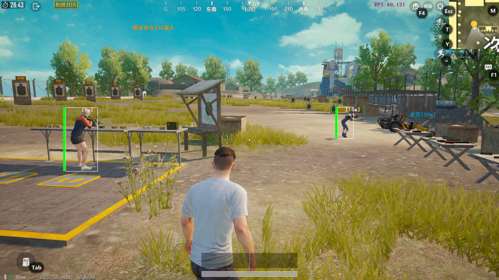
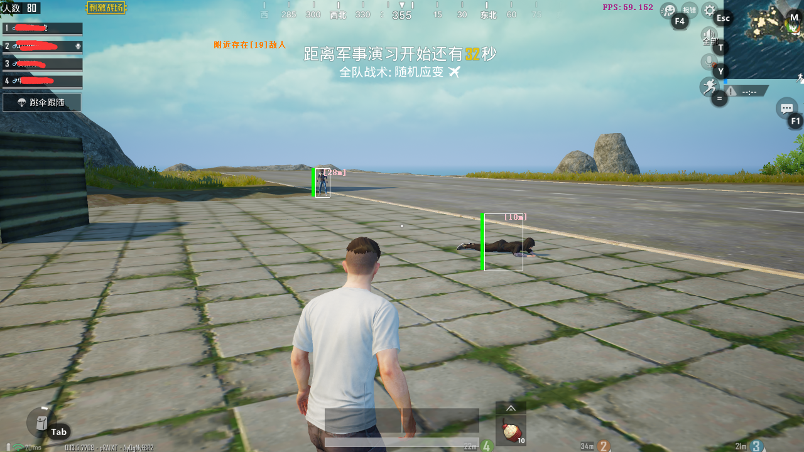

# pubg-mobile-esp
刺激战场腾讯模拟器方框透视+磁性自瞄

## 效果图





* 只在win10上测试过，打到皇冠还未出现封号情况...
* 磁性自瞄需要根据自己运行游戏时的窗口大小和分辨率调整下
* 关于内存读写，win10模拟器上的TP只是注册了几个回调，绕过方法很多，参考代码如下：

```c++
OB_PREOP_CALLBACK_STATUS preCall(PVOID RegistrationContext, POB_PRE_OPERATION_INFORMATION pOperationInformation)
{
	UNREFERENCED_PARAMETER(RegistrationContext);
	pOperationInformation->Parameters->CreateHandleInformation.DesiredAccess = PROCESS_ALL_ACCESS;
	pOperationInformation->Parameters->CreateHandleInformation.OriginalDesiredAccess = PROCESS_ALL_ACCESS;
	return OB_PREOP_SUCCESS;
}

NTSTATUS ObPassProcessProtect()
{
	NTSTATUS obst1 = 0;
	OB_CALLBACK_REGISTRATION obReg;
	OB_OPERATION_REGISTRATION opReg;
	memset(&obReg, 0, sizeof(obReg));
	obReg.Version = ObGetFilterVersion();
	obReg.OperationRegistrationCount = 1;
	obReg.RegistrationContext = NULL;
	RtlInitUnicodeString(&obReg.Altitude, L"23002");
	obReg.OperationRegistration = &opReg;
	memset(&opReg, 0, sizeof(opReg));
	opReg.ObjectType = PsProcessType;
	opReg.Operations = OB_OPERATION_HANDLE_CREATE | OB_OPERATION_HANDLE_DUPLICATE;
	opReg.PreOperation = (POB_PRE_OPERATION_CALLBACK)&preCall;
	obst1 = ObRegisterCallbacks(&obReg, &obPassProtectHandle);
	return NT_SUCCESS(obst1) ;
}
```


